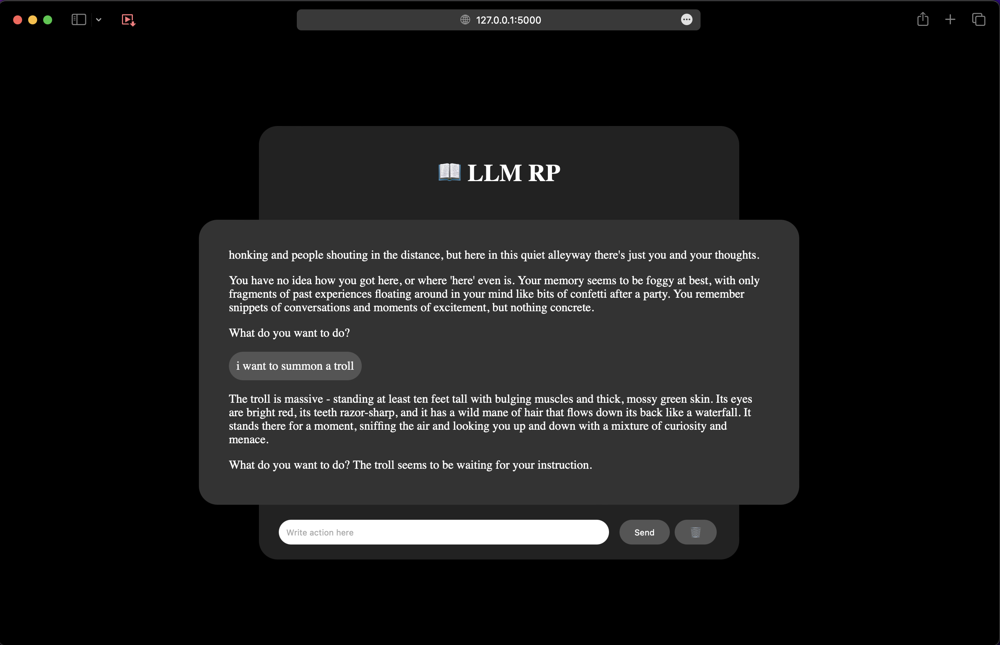

# 📖 LLM RP

Your Custom Role Play with AI on Mac and Linux (for now).



## 📝 Requirement

For now:
- Install `WizardLM-13B-V1.0-Uncensored/ggml-model-q4_0.bin` model in `llama.cpp/models`.

## 👉🏻 Start

Each time you want to run the game:

```bash
python3 webui/app.py
```

Next open your browser at http://127.0.0.1:5000

Click on the 🗑️ for reset le Role Play

You can customize the prompt `prompts/RolePlayV1.txt`

## 📝 Todo

- 💾 Create a persistent role play (with save system)
- 🖼️ Adding Stable Diffusion
- 🛠️ Compile for GPU Linux / GPU Windows
- 📎 Adding model downloader, installer and quantizer
- 🎤 Adding [whisper.cpp](https://github.com/ggerganov/whisper.cpp)
- 🔉 Adding [Bark](https://github.com/suno-ai/bark) or an other Text-Prompted Generative Audio Model
- 🔥 Doing a better interface
