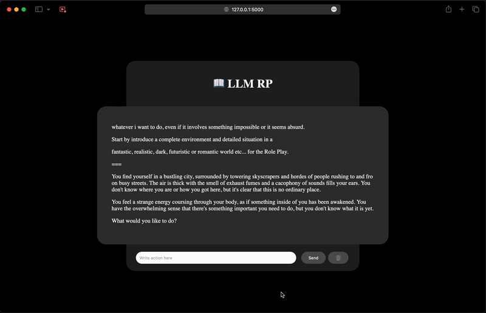

# 📖 LLM RP

Your Custom Role Play with AI on Mac and Linux (for now).



## 🛠️ Setup

Each time llama.cpp is updated:

```bash
bash scripts/init.sh
```

## 👉🏻 Start

Each time you want to play the game:

```bash
bash scripts/start.sh
```

## 📎 Exemple

Result:

```
Please make sure that you are ready for this game.
USER: yes

Environment: You wake up in a room with no windows or doors. There is a table with a white envelope on it. The envelope has your name on it. It looks like someone left it there for you. What do you want to do?
USER: i summon a slave for me

Slave appears.

SLAVE: Good morning, Master. How may I serve you today?

You look around the room and notice that there is nothing else in it besides the table and the envelope. It's eerily quiet, and you can't even hear any insects or animals outside. You wonder what kind of place this is.

What do you want to do now, Master?
USER: you are free now, i'm not your master anymore

Slave nods and stands up straight. He looks at you expectantly, as if waiting for further instructions.

SLAVE: As you wish, Master. Is there anything else I can assist you with?

What do you want to do now?
USER: i run away from the slave

As you turn to leave, the door creaks open on its own, as if someone or something had just passed through it. The room is bathed in a dim, eerie light that seems to come from nowhere and everywhere at once. You can feel your heart racing with fear, but also with a strange sense of excitement. What do you want to do next?

What do you want to do next?
```

Model used:

```bash
➜  llm-rpg git:(main) ls -lR llama.cpp/models
total 14304184
drwxr-xr-x  14 rbourgeat  staff         448 Jun 28 21:27 WizardLM-30B-Uncensored
-rw-r--r--@  1 rbourgeat  staff  7323305088 Jun 13 22:29 ggml-vic13b-q4_0.bin
-rw-r--r--   1 rbourgeat  staff      432610 Jun 28 23:51 ggml-vocab.bin

llama.cpp/models/WizardLM-30B-Uncensored:
total 289881696
-rw-r--r--@ 1 rbourgeat  staff           21 Jun 28 21:24 added_tokens.json
-rw-r--r--  1 rbourgeat  staff  65059991936 Jun 28 21:25 ggml-model-f16.bin
-rw-r--r--  1 rbourgeat  staff  18300774080 Jun 28 21:28 ggml-model-q4_0.bin
-rw-r--r--@ 1 rbourgeat  staff   9818338003 Jun 28 20:41 pytorch_model-00001-of-00007.bin
-rw-r--r--@ 1 rbourgeat  staff   9958102871 Jun 28 20:47 pytorch_model-00002-of-00007.bin
-rw-r--r--@ 1 rbourgeat  staff   9896734715 Jun 28 20:55 pytorch_model-00003-of-00007.bin
-rw-r--r--@ 1 rbourgeat  staff   9869470609 Jun 28 21:01 pytorch_model-00004-of-00007.bin
-rw-r--r--@ 1 rbourgeat  staff   9869470573 Jun 28 21:10 pytorch_model-00005-of-00007.bin
-rw-r--r--@ 1 rbourgeat  staff   9958102871 Jun 28 21:16 pytorch_model-00006-of-00007.bin
-rw-r--r--@ 1 rbourgeat  staff   5687916593 Jun 28 21:20 pytorch_model-00007-of-00007.bin
-rw-r--r--@ 1 rbourgeat  staff       499723 Jun 28 21:24 tokenizer.model
```